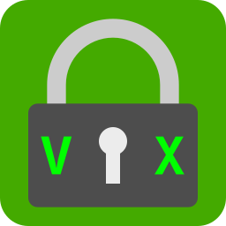
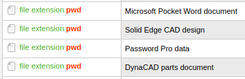

# Password Manager

This will be an App for storing passwords securely in a single database file.

A user password (entered by the user) will be associated with the database file to unlock it along with a salt string stored in the software settings.

The AES encryption algorithm will be used in two stages to encrypt the saved data. See the [Docs](#docs) for more info.

A SHA256 hash of the combined hashed password and salt is used to form the key.

The encrypted database is saved along with an IV vector.

The integrity of the decoded data will be checked by the presence of a prefixed hash in the decoded data that equals a hash of the database data.

## Branding

**passwordvx**

An alternative example: **password-vx**

You saw it here first!

A suggested interpretation of "vx" is: "version x"

Case insensitive examples:

password VX

Password VX

Password-VX

PasswordVX

We claim any combination of "password" and "vx" as prior art representing this brand.

## Features

* Suggest easy to remember but hard to crack passwords
* Analyze password strength using the zxcvbn methods
* Store name, password, URL, creation date, last update date, notes
* Search
* List in order of usage frequency
* Categories
* Feature to create a copy of the file with incremented index value
* Generate password salt value for each install and allow for display/modification of it
* Import data from Keepass2 database

## Reference Links

[AES Encryption Modes Tutorial](https://www.highgo.ca/2019/08/08/the-difference-in-five-modes-in-the-aes-encryption-algorithm/)

[zxcvbn: realistic password strength estimation](https://dropbox.tech/security/zxcvbn-realistic-password-strength-estimation) - 10-year-old article. How far have we progressed?

[zxcvbn Python](https://github.com/dwolfhub/zxcvbn-python) - the reference code used to port zxcvbn to GDScript here.

[KeePass2.x C# Source Code](https://github.com/dlech/KeePass2.x) - unofficial mirror on GitHub.

[KeePass Database Decryption Tutorial](https://weekly-geekly.imtqy.com/articles/346820/index.html)

Hey, support my work! [Buy me a coffee](https://buymeacoffee.com/gdscriptdude)

## Testing

Unit testing is implemented with the [GUT](https://github.com/bitwes/Gut) framework which may be installed from the Godot Asset Library in the Editor.

The directory for the tests should be set to `res://test`

## Docs

[Password Salting](docs/password_salting.md)

[Data Encryption](docs/data-encryption.md)

## Password Database File Format

We will store a sequence of bytes comprised of IV (16 bytes) + encrypted data bytes.

The file will be saved with a `.pwd` extension that means **password data**.

Other uses for this file extension:

## ToDos

* Debug how to unzip the KeePass Gzipped database given the master key
* Extract passwords from example KeePass database given the algorithm
* Consider minimizing the memory footprint of clear passwords on a device
* Create password suggestion tool
* Write article comparing this to alternative solutions
