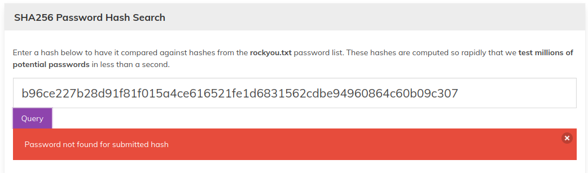

# Password Salting

Commonly used passwords are well known and millions of them are stored in databases and used to try to crack password entry points. A very simple countermeasure to take on the Server/App side is to add a `salt` value to the password so that it does not match with any of the well known passwords.

The user should remember what their password is, but the server does not record this, it records a combination of what the user enters combined with the salt value and then hashed before saving this value in the database.

So we take the user-entered password and combine it with a string of random characters, and then apply a hashing function that one-way encodes it to a 256-bit data value that we are happy to store in the clear.

With this approach it takes immense effort/computing power to find the original password (unless the salt value is known).

If the salt value is known, then the lookup table approach may be used effectively. So it is crucial that the salt value is generated by the computer and not thought up by a user.

Here are the results of using an online password cracker service where the password is the most common one, yet a simple salt value was applied:

We generated a SHA256 of our salted password and entered it to the online password cracker.

As you can see, they cannot crack the "password" using their GPUs and millions of lookups.

So that gives us a first rule of thumb for implementing a robust password protection system:

* Create a Salt value that we don't save with our data file

## To crack the password when you know the Salt value

In this case you would loop through the database of common passwords, combine each one with the Salt value, and then generate the hash value to compare with the one that you are trying to crack.

This is just more time-consuming, but not very time-consuming. Of course, you can make it cumbersome to figure out how to combine the salt value with the password, but if your project is Open Source, then it is a pointless exercise.

## To crack the password when you don't know the Salt value

In this case you need to Brute Force the salt value which could involve huge numbers of combinations. So this exercise becomes massively more expensive in terms of time and computing power.

## How to know when you have cracked the password?

You expect to see something recognizable as a common file format or recognizable text strings.

Now this leads us on to the next stage: **how to encrypt data**.